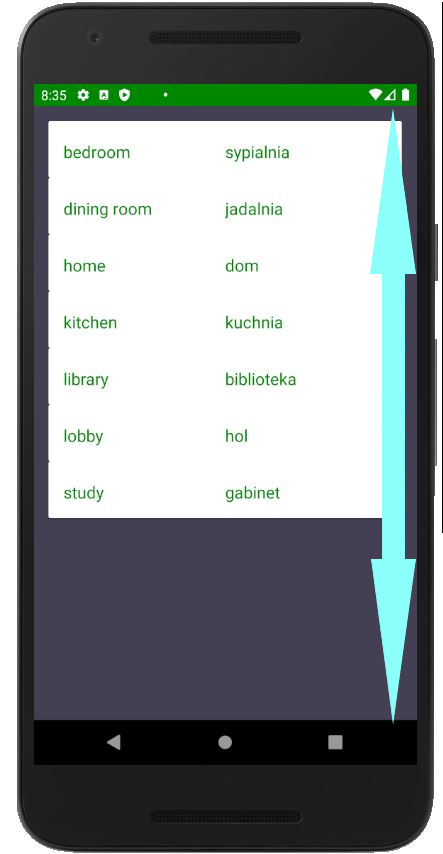
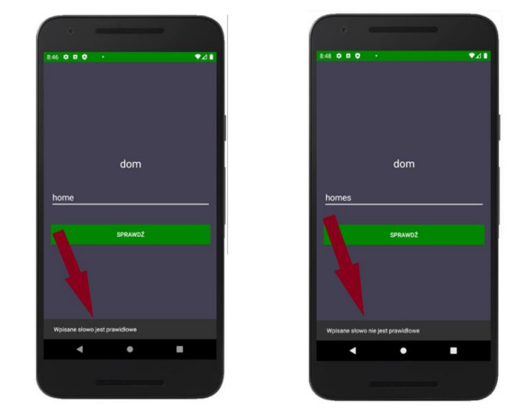

    

## Spis treści
* [Informacje ogólne](#informacje-ogólne)
* [Wykorzystane technologie](#wykorzystane-technologie)
* [Uruchomienie](#uruchomienie)
* [Funkcjonalności projektu](#funkcjonalności-projektu)
* [Szczegóły dotyczące realizacji](#szczegóły-dotyczące-realizacji)

## Informacje ogólne
Aplikacja do nauki słownictwa oraz gramatyki języka 
angielskiego dla urządzeń z systemem Android. Uwzględniając możliwość dodawania 
przez użytkownika własnych słów do bazy danych oraz naukę ich za pomocą e-fiszek i 
porównywania pisowni słownictwa. Zawierające podstawowe zagadnienia gramatyczne związane z nauką
języka angielskiego, takiego jak wyjaśnienie konstrukcji czasów.

## Wykorzystane technologie
- Kotlin
- SQLite
- Gradle
- Jetpack Compose

## Uruchomienie
Wymaganie sprzętowe zapewniające parwidłowe działanie aplikacji:
- wymgana wersja systemu operacyjnego od Android 4.4 (KitKat) (API level 19) do Android 10 (Q) (API level 29)
- rozmiar do pobrania 6 MB
- wymagana wersja Kotlin 1.4.10
- wymagana wersja Javy 1.8

## Funkcjonalności projektu
<h3 align="center"> System rejestracji i logowania </h3>  

  

  

<h3 align="center"> Menu nawigacyjne </h3>  

<h3 align="center"> System dodawania słów </h3>  

  

  

<h3 align="center"> System przeglądania bazy słownictwa </h3>  

<h3 align="center"> System nauki słownictwa poprzez e-fiszki</h3>  

  

  

<h3 align="center">System nauki słownictwa poprzez porównywanie pisowni </h3>  

<h3 align="center">System nauki gramatyki </h3>  

## Szczegóły dotyczące realizacji
W projekcie została stworzona nierelacyjna baza danych(NoSQL) zawierające następujące tabele:
- tabela użytkowników
- tabele kategorii słownictwa.

Do każdej z tabel zostały stworzone osobne klasy `data`, które odpowiadają za przechowywanie jednego wiersza w tabeli. Kontrukcja przykładowej klasy dla tabeli
użytkowników wygląda następująco:

`data class User(val id: Int=-1, val name: String, val email: String, val password: String)`

Cała nierelacyjna baza danych została stworzona przy pomocy klasy pomocniczej `SQLiteOpenHelper`, która korzysta z systemu SQLite. 

System logowania oraz rejestracji zostały zaprojektowane na komponentach aktywności, natomiast gółwny panel użytkownika wraz z jego funkcjami został stworzony 
na komponentach fragmentu. Co pozwoliło na stworzenie bocznego menu aplikacji ułatwiającego poruszanie się po projekcie. 

Na potrzeby stworzenia e-fiszek została wykorzystana dostępna publicznie biblioteka [_EasyFlipView_](https://github.com/wajahatkarim3/EasyFlipView),przy wykorzystaniu której
zostały stworzone obracane kartki emitujące papierowe fiszki ze słowami w języku obcym i ich tłumaczeniem.

